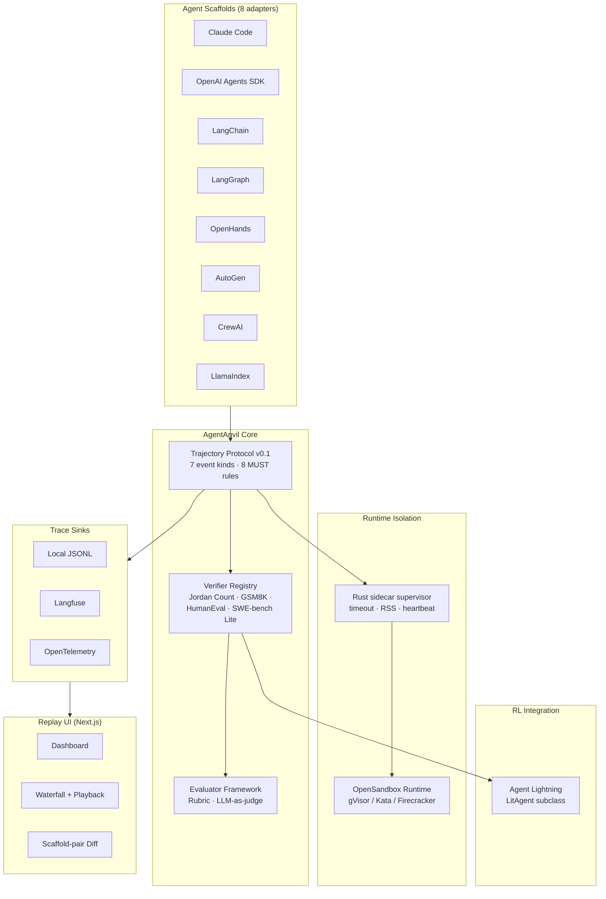

# AgentAnvil

**Scaffold-agnostic agent evaluation & training harness.**

Plug any agent scaffold — Claude Code, OpenAI Agents SDK, LangChain, LangGraph, OpenHands, AutoGen, CrewAI, LlamaIndex — into one normalized trajectory protocol. Run it against verifiable tasks. Observe via Langfuse or OpenTelemetry. Replay in a Next.js dashboard. Hook into an Agent Lightning RL loop without rewriting your agent code.


<p align="left">


</p>

---

## Why

Every agent scaffold has its own trajectory representation, its own tool-call encoding, its own trace format. That makes cross-scaffold evaluation, debugging, and RL integration a pile of ad-hoc adapters.

**AgentAnvil's thesis: one trajectory protocol, many adapters.** If the protocol is right, everything else — evaluation, visualization, RL wiring, sandbox isolation — composes cleanly on top.

See [`docs/DESIGN.md`](docs/DESIGN.md) for the 400-word architecture summary, or [`docs/TRAJECTORY_PROTOCOL.md`](docs/TRAJECTORY_PROTOCOL.md) for the formal v0.1 spec (7 event kinds, 8 MUST rules, JSON schema, tool-call normalization table across 4 scaffolds).

## Architecture



## Quickstart

```bash
# 1. Install
pip install -e '.[all]'

# 2. Point at an LLM
export ANTHROPIC_API_KEY=...

# 3. Seed a 10-scaffold demo on Jordan Count (no API cost)
python3 examples/seed_demo_traces.py

# 4. View the dashboard
cd ui && npm install && npm run dev
open http://localhost:3001

# 5. Or run a real evaluation over a pack via the aa CLI
aa packs list
aa eval run gsm8k-mini --adapter minimal --limit 5
aa traces stats

# 6. (Optional) Supervise a rollout with timeout + RSS monitoring
cd supervisor && cargo build --release
./target/release/agentanvil-supervisor run --timeout 300 --grace 10 \
    --socket /tmp/anvil.sock -- python3 ../examples/run_jordan_count.py

# 7. (Optional) Deploy to Kubernetes (kind)
./deploy/kind-setup.sh
```

## Core design

### Unified Trajectory Protocol v0.1

A trajectory is a flat sequence of typed events. Every scaffold maps to the same types:

| Event         | Direction       | Meaning                          |
| ------------- | --------------- | -------------------------------- |
| `observation` | env → agent     | What the agent sees              |
| `thought`     | agent internal  | Reasoning / chain-of-thought     |
| `tool_call`   | agent → env     | Function / tool invocation       |
| `tool_result` | env → agent     | Tool call result                 |
| `final_answer`| agent → env     | Terminal answer                  |
| `reward`      | verifier → log  | Scalar reward + correctness      |
| `error`       | any             | Failure state                    |

Scaffold-agnostic, JSON-serializable, deliberately narrow. Replay + scoring + RL reward assignment — not faithful reconstruction of scaffold internals.

Conformance is enforced by `agentanvil.schema.validate()`; every adapter carries a dependency-free `from_*()` fixture helper, so `tests/test_new_adapters_conformance.py` exercises every adapter against the spec without a single external pip install.

### Verifier + Evaluator

- **Verifiers** answer *"did the agent get the right answer?"* — single `VerifyResult` with strict parsing (no heuristic repair).
- **Evaluators** answer *"how well did they do it?"* — any number of `EvalScore` objects via `EvaluatorRegistry`, including `LLMJudgeEvaluator` backed by Haiku / gpt-5-nano.

### Runtime isolation (intentionally layered)

- **Rust sidecar supervisor** (~270 LOC): monitor PID + peak RSS, wall-clock timeout with SIGTERM → SIGKILL escalation, Unix-socket JSON heartbeat. Explicitly NOT seccomp / namespaces / cgroups.
- **OpenSandbox runtime** (`agentanvil/runtime/opensandbox.py`): real alibaba/OpenSandbox SDK wrapper. `OpenSandboxRuntime` + `ToolCallRouter` route `python.exec` / `shell.run` / `fs.*` into a sandboxed container running under gVisor, Kata Containers, or Firecracker microVM.
- **K8s Helm chart** (`deploy/helm/agentanvil/`): production-flavored securityContext — `runAsNonRoot`, `readOnlyRootFilesystem`, `seccompProfile: RuntimeDefault`, `capabilities.drop: [ALL]`, resource requests + limits.

### RL integration

`agentanvil.adapter.agent_lightning`: `AnvilLitAgent` dynamically subclasses `agentlightning.LitAgent` when the package is installed. `train_with_agent_lightning()` runs the real `Trainer.fit()` or falls back to `ALTrainerStub` for dep-free dev.

## Matrix

### Scaffolds (8 production adapters)

| Scaffold            | Native input                          | Status |
| ------------------- | ------------------------------------- | ------ |
| Minimal             | raw Anthropic / OpenAI call           | ✅ |
| OpenAI Agents SDK   | `Runner.run()` RunItem stream         | ✅ |
| LangChain           | `AgentExecutor.intermediate_steps`    | ✅ |
| Claude Code         | headless CLI + `stream-json` parser   | ✅ |
| OpenHands           | Action / Observation event stream     | ✅ |
| AutoGen             | ChatMessage / HandoffMessage          | ✅ |
| CrewAI              | `Crew.kickoff()` TaskOutput           | ✅ |
| LangGraph           | state-graph message channel           | ✅ |
| LlamaIndex          | legacy ReActAgent + v0.12 Workflow    | ✅ |

### Verifiers (4 shipped + evaluator framework)

| Verifier         | Task shape                      | Scoring |
| ---------------- | ------------------------------- | ------- |
| `JordanCount`    | vision inside-outside counting  | strict ANSWER parser, binary |
| `GSM8K`          | grade-school math               | `#### N` parser with tolerance |
| `HumanEval`      | Python function completion      | real subprocess execution |
| `SWEBenchLite`   | GitHub issue → patch            | file-jaccard + hunk overlap |

Plus `EvaluatorRegistry`: `ContainsKeywords`, `Regex`, `LengthBand`, `NoForbiddenWords`, `TrajectoryShape`, `Rubric`, `LLMJudge`.

### Datasets

Five on-disk packs under `agentanvil/packs/`:
`gsm8k-mini` (20) · `humaneval-mini` (12) · `jordan-count-mini` (6) · `swe-bench-micro` (4) · `simple-qa-mini` (10)

## Benchmark: `claude-code` × `gsm8k-mini` (real run)

Run via the headless Claude Code CLI on all 20 tasks of `gsm8k-mini` — real subprocess invocations, `stream-json` parsed into the v0.1 trajectory protocol, verified by the `GSM8K` strict parser, written to `traces/bench_cc_gsm8k.jsonl` (committed).

| Scaffold      | Pack             | N  | Correct | Accuracy  | Avg events | Wall time | Avg / task |
| ------------- | ---------------- | -- | ------- | --------- | ---------- | --------- | ---------- |
| `claude-code` | `gsm8k-mini`     | 20 | 19      | **95.0%** | 4.0        | 1m 37s    | ~4.9s      |
| `claude-code` | `humaneval-mini` | 12 | 7       | **58.3%** | 4.0        | 0m 54s    | ~4.5s      |

Protocol conformance: **32/32** trajectories pass `aa validate` (zero issues).

Both misses surfaced by the harness are **format-boundary issues, not model failures** — exactly what the harness is built to flag:

- `gsm8k-mini/011` — gold is `4.5` (`3/4 cup × 6 batches`) but the prompt template hard-codes `#### <integer>`. Verifier correctly caught `4.0 ≠ 4.5`. Fix: widen the GSM8K parser to accept decimals, or scrub fractional items from the pack.
- `humaneval-mini/008-012` — model returned a correct function body inside a fenced ```python block without the `def name(...):` signature; the strict verifier expected a full definition. The harness exposes the trade-off between *strict-parse verifiers* (no false positives, but brittle against scaffold formatting) and *lenient extractors* (robust, but may launder mistakes). Both have a place; the harness lets you pick per benchmark.

Reproduce:

```bash
python3 -m agentanvil.cli eval run gsm8k-mini --adapter claude-code \
    --out traces/bench_cc_gsm8k.jsonl
python3 -m agentanvil.cli traces stats --path traces/bench_cc_gsm8k.jsonl
python3 -m agentanvil.cli validate traces/bench_cc_gsm8k.jsonl
```

## Tests

```
protocol_conformance        11/11
new_adapters_conformance     5/5   (OpenHands / AutoGen / CrewAI / LangGraph / LlamaIndex)
new_verifiers               12/12  (GSM8K / HumanEval real subprocess / SWE-bench Lite)
dataset                     10/10
cli                          6/6
evaluator                   21/21  (programmatic / rubric / LLM judge with stub / registry)
opensandbox_runtime         14/14
agent_lightning_stub         5/5
agent_lightning_real         7/7
────────────────────────────────
Python                      91/91
Rust (supervisor)            5/5
────────────────────────────────
TOTAL                       96/96  🟢
```

## CLI

```
aa packs list                         # available task packs
aa packs show gsm8k-mini              # inspect a pack
aa eval run <pack> [--adapter ...]    # run adapter across pack, write traces
aa traces tail [--path ...]           # recent trajectories
aa traces stats [--path ...]          # accuracy + event count per scaffold
aa validate <jsonl>                   # v0.1 conformance validator
```

## Docs

- [`docs/DESIGN.md`](docs/DESIGN.md) — 400-word architecture summary
- [`docs/TRAJECTORY_PROTOCOL.md`](docs/TRAJECTORY_PROTOCOL.md) — formal v0.1 spec
- [`docs/ADAPTERS.md`](docs/ADAPTERS.md) — scaffold adapter catalog + authoring guide
- [`docs/VERIFIERS.md`](docs/VERIFIERS.md) — verifier vs evaluator separation
- [`docs/DEPLOYMENT.md`](docs/DEPLOYMENT.md) — local / single-host / Kubernetes

## License

MIT.
